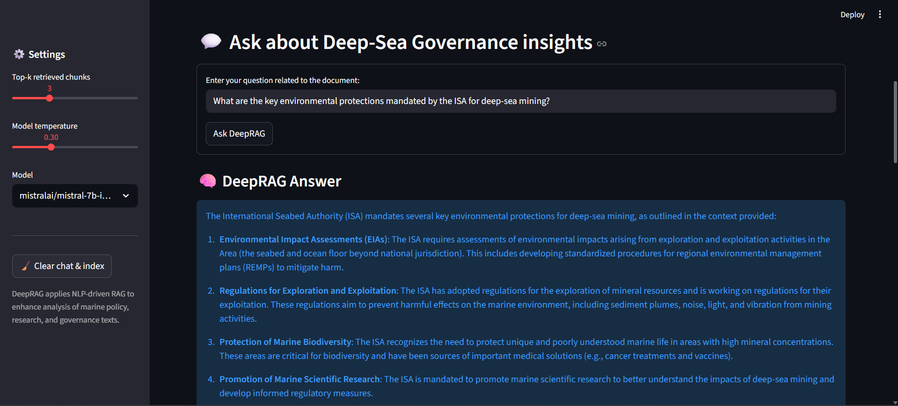
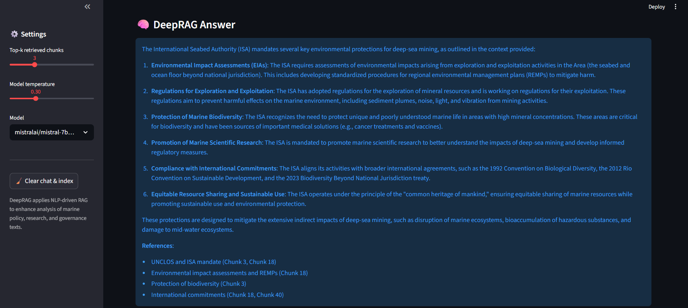
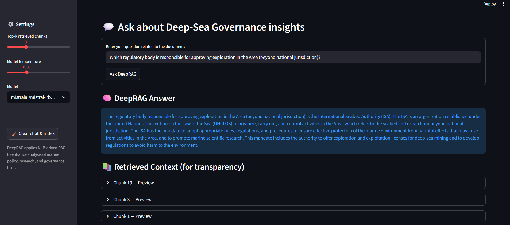

## DeepRAG - Document Intelligence for Deep-Sea Governance


A compact **Streamlit RAG (Retrieval-Augmented Generation)** app for analyzing deep-sea governance, marine policy, and environmental reports.  
Upload PDFs, build a semantic index, and generate contextual insights grounded in the source documents.

---

### Quick Start (Windows / PowerShell)

```powershell
python -m venv .\venv
venv\Scripts\activate
pip install -r requirements.txt
streamlit run src/app.py
```

Open: [http://localhost:8501](http://localhost:8501)

---

### Configuration

Set your OpenAI-compatible key before running:

```powershell
setx OPENAI_API_KEY "sk-..."
```

or create `.streamlit/secrets.toml`:

```toml
openai_api_key = "sk-..."
```

---

### Usage

1. Upload a deep-sea governance PDF (policy, EIA, or research).
2. Wait for chunking & embedding.
3. Ask a question — get a **generated** answer with source context.

---

### Sample Deep-Sea Topics

- Deep-sea mining governance and regulation
- Marine biodiversity and habitat protection
- Sustainable blue economy frameworks

---

### Demo







